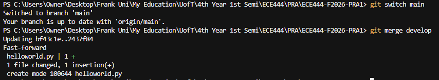
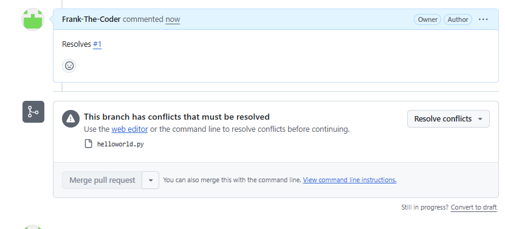
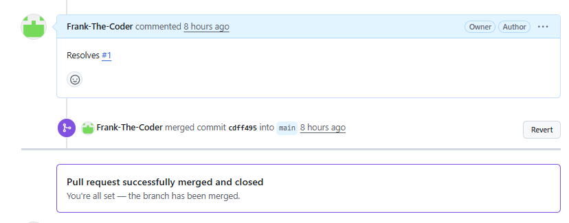
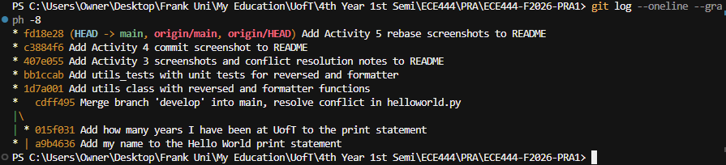
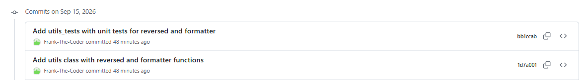
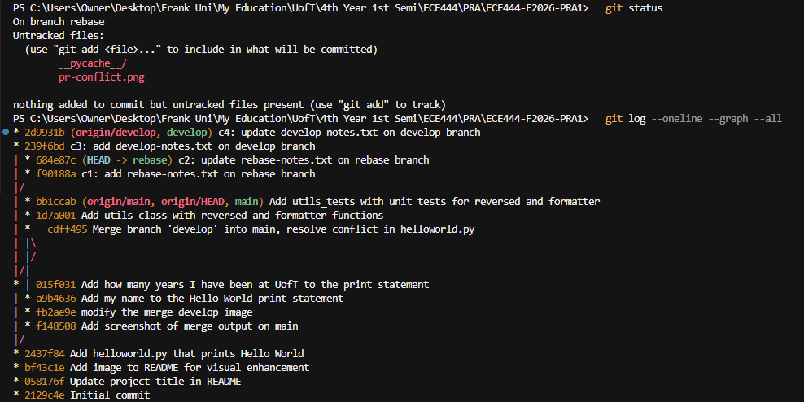
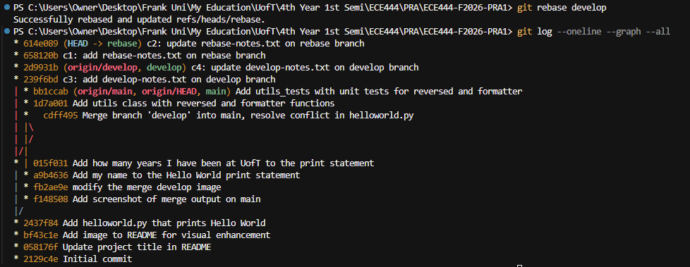
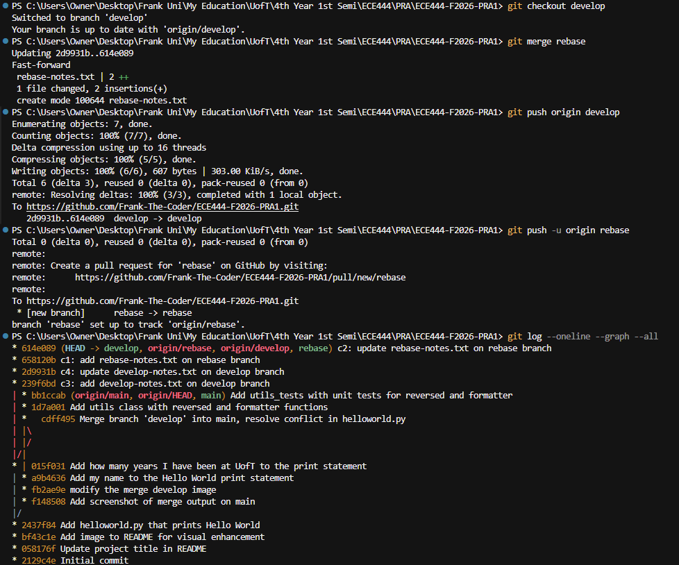

# Frank (Qingtao) Liu


## Merge output on `main`



## Activity 3: Issue, pull request and merge conflict

Issue [#1](https://github.com/Frank-The-Coder/ECE444-F2026-PRA1/issues/1) asked for the number of years at UofT to be printed.
`main` added my name to the print statement and `develop` added the years on the same line, so pull request
[#2](https://github.com/Frank-The-Coder/ECE444-F2026-PRA1/pull/2) (develop -> main) reported a conflict:



The conflict was resolved on the command line by merging `develop` into `main`, keeping both changes:

```
$ git merge develop
Auto-merging helloworld.py
CONFLICT (content): Merge conflict in helloworld.py
Automatic merge failed; fix conflicts and then commit the result.

$ cat helloworld.py
<<<<<<< HEAD
print("Hello World, my name is Frank (Qingtao) Liu")
=======
print("Hello World, I have been at UofT for 4 years")
>>>>>>> develop

# edited to:  print("Hello World, my name is Frank (Qingtao) Liu and I have been at UofT for 4 years")
$ git add helloworld.py
$ git commit -m "Merge branch 'develop' into main, resolve conflict in helloworld.py"
$ git push origin main
```

After the push GitHub detected that `main` contained every commit from `develop` and marked the pull request as merged and closed.



The merge commit `cdff495` on `main` has two parents, one from each branch:



## Activity 4: Unit tests

`utils.py` defines the `utils` class with `reversed` and `formatter`; `utils_tests.py` tests both with integer, float and string inputs.
Run with `python -m unittest utils_tests -v`.



## Activity 5: Git rebase

Branch `rebase` was created from `develop` with commits c1 and c2. Then c3 and c4 were added on `develop`.

Before the rebase, c1/c2 and c3/c4 sat on separate lines of history:



`git rebase develop` (run on the `rebase` branch) replayed c1 and c2 on top of c4, giving them new commit hashes:



`develop` was then fast-forwarded to the rebased commits and both branches were pushed. Final order: c3 -> c4 -> c1 -> c2.


